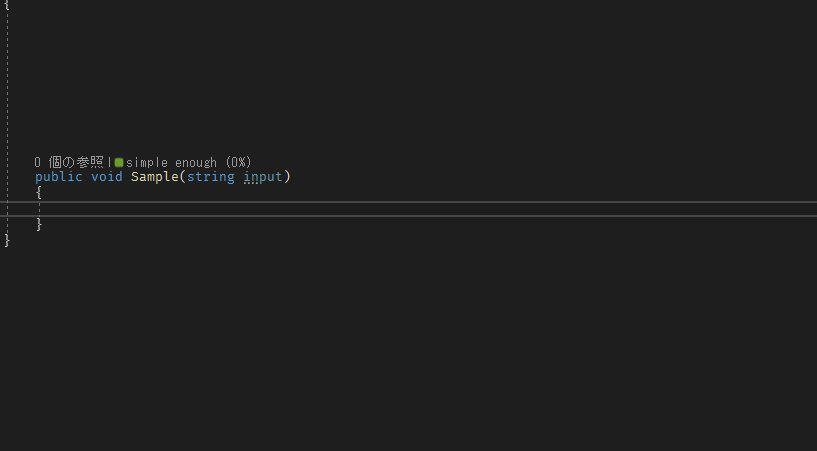
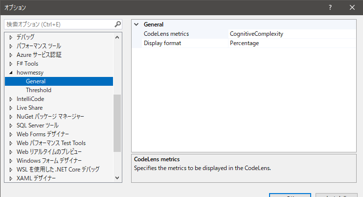
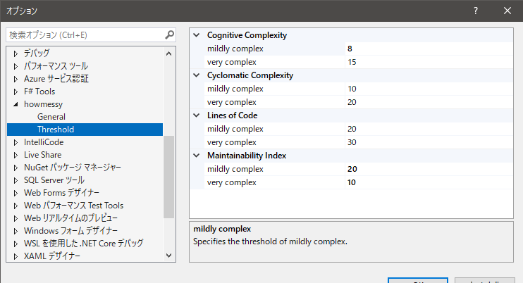

# howmessy
howmessy is a Visual Studio extension to display code metrics in CodeLens. The following metrics are supported.

- Cognitive Complexity
- Cyclomatic Complexity
- Maintainability Index
- Lines of Code



## Options




## Support Versions

- Visual Studio 2022

## CLI tool
howmessy provides a CLI tool for calculating metrics.

Usage:
```sh
$ howmessy --help
howmessy 1.0.0
Copyright (C) 2022 howmessy

  -m, --metrics    Required. Metrics type to analyze (cognitive/cyclomatic/mi/loc).

  -t, --target     Fully qualified ethod name to analyze.

  -f, --format     Output format.

  --help           Display this help screen.

  --version        Display version information.

  path (pos. 0)    Required. File path to analyze.
```

Sample:
```sh
$ cat ./Sample.cs
namespace HowmessySample

public class Sample
{
    public void Main(string input)
    {
        if (!string.IsNullOrWhiteSpace(input))
        {
            // output
            Console.WriteLine(input);
        }
    }
}

$ howmessy ./Sample.cs --metrics cognitive,cyclomatic,mi,loc
[
  {
    "Name": "HowmessySample.Sample.Main(string input)",
    "CognitiveComplexity": 1,
    "CyclomaticComplexity": 2,
    "MaintainabilityIndex": 76,
    "LinesOfCode": {
      "Physical": 5,
      "Logical": 4
    }
  }
]
```

## Thanks

This software was inspired by the following repository.

- [matkoch/resharper-cognitivecomplexity](https://github.com/matkoch/resharper-cognitivecomplexity)

And some code was borrowed from the following repository.

- [bert2/microscope: CodeLens extension for Visual Studio that lets you inspect the intermediate language instructions of methods and properties.](https://github.com/bert2/microscope)

## Author

- Takumi Yamada (Twitter: [@tackme31](https://twitter.com/tackme31))

# License
This software is licensed under the MIT license. See [LICENSE](./LICENSE).

---

<a target="_blank" href="https://icons8.com/icon/frKq3ROpdX3N/border">Border</a> icon by <a target="_blank" href="https://icons8.com">Icons8</a>